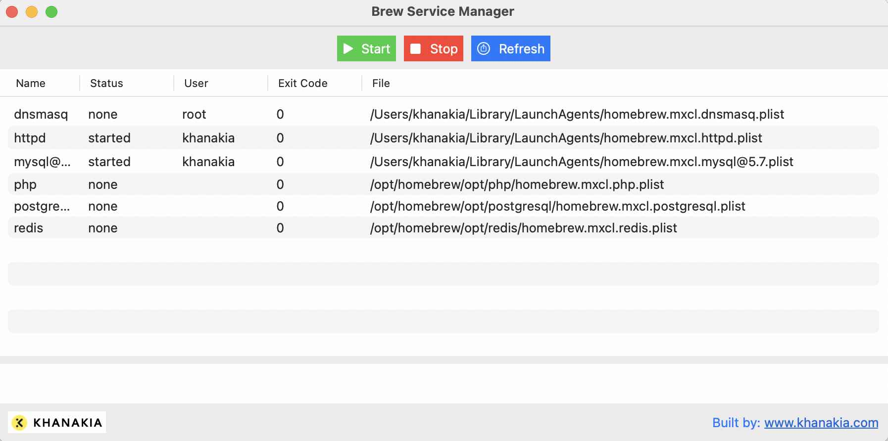

# Brew Service Manager (Macos)

GUI tool to to manage brew services.

Manage all the your running brew services directly from Brew Service Manager. No need to hassle anymore with terminal.

You can Start and Stop any service.

## How to Install:
Download the Brew Service Manager.app
Unzip the the Zip file
Move the Brew Service Manager.app to your Application Directory

